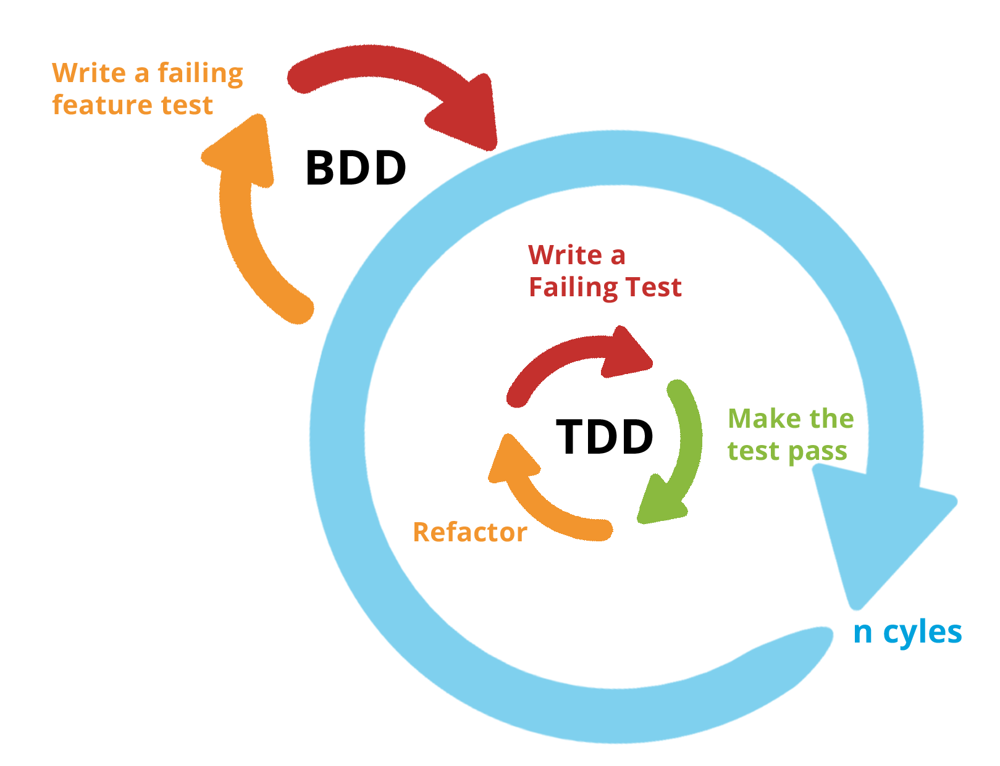

# What is TDD ?
Test-driven development is a software development process relying on software requirements being converted to test cases before software is fully developed, and tracking all software development by repeatedly testing the software against all test cases. 
* Navigate to TestableCode app: [Click here](https://github.com/programfiction/FictionTestableCode)

# Unit testing Guidelines for .net5(c#)
Unit testing is a subset of Test driven development. It’s a step need to add in software development process to improve testability of code. Unit testing makes application simple, testable & maintain. I will suggest an approach that makes unit testing effective.
 - Writing testable code (to write code that is easy to test).
 - Writing effective unit test cases to test the code.
## Benefits of unit testing
- Reduces bugs
- Reduce cost
- Improves design
- Documentation 
- Eliminate fear to change in code
## How to write testable code
- Create seams in code 
- Simplify construction
- Program to interface
- Work with dependencies 
- Decouple from global state
- Maintain single responsibility 
- Use Test driven development

	

***
 [Read More on Microsoft Site](https://docs.microsoft.com/en-us/dotnet/core/testing/unit-testing-best-practices)
 
 ## What is code coverage?
- `Answer` :
A high code coverage percentage is often associated with a higher quality of code. However, the measurement itself cannot determine the quality of code. Setting an overly ambitious code coverage percentage goal can be counterproductive. Imagine a complex project with thousands of conditional branches, and imagine that you set a goal of 95% code coverage. Currently the project maintains 90% code coverage. The amount of time it takes to account for all of the edge cases in the remaining 5% could be a massive undertaking, and the value proposition quickly diminishes.

A high code coverage percentage is not an indicator of success, nor does it imply high code quality. It just represents the amount of code that is covered by unit tests. For more information, see unit testing code coverage.
- Test only one code at a time
- Write Independent unit tests and avoid chaining
- Mock out all service calls and database operations.
- Follow naming conventions for your unit test to understand what it does
- All methods should have appropriate unit tests.
- Don't perform multiple assertions in single test, instead write multiple unit tests.
- Use appropriate assertion methods and mention assertion parameters in proper order.
- Make sure that your test code should not be part of production code.
- Don't print anything out in in unit tests.
- Don't skip unit tests instead remove it from source code.

## Some more best practices:
- Unit tests should be readable.
No one wants to spend time trying to figure out what is that your test does. Ideally, this should be clear just by looking at the test name.

- Unit tests should be maintainable.
We should try to write our tests in a way that minor changes to the code shouldn’t make us change all of our tests. The DRY (don’t repeat yourself) principle applies here, and we should treat our test code the same as the production code. This lowers the possibility that one day someone gets to the point where he/she needs to comment out all of our tests because it has become too difficult to maintain them.

- Unit sets should be fast.
If tests are taking too long to execute, it is probable that people will run them less often. That is certainly a bad thing and no one wishes to wait too long for tests to execute.

- Unit tests should not have any dependencies.
It is important that anyone who is working on the project can execute tests without the need to provide access to some external system or database. Tests need to run in full isolation.

- Make tests trustworthy rather than just aiming for the code coverage.
Good tests should provide us with the confidence that we will be able to detect errors before they reach production. It is easy to write tests that don’t assert the right things just to make them pass and to increase code coverage. But there is no point in doing that. We should try to test the right things to be able to rely on them when the time comes to make some changes to the code
